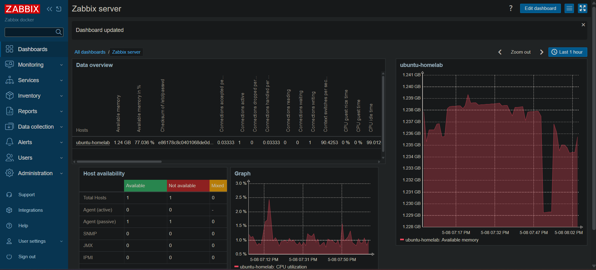
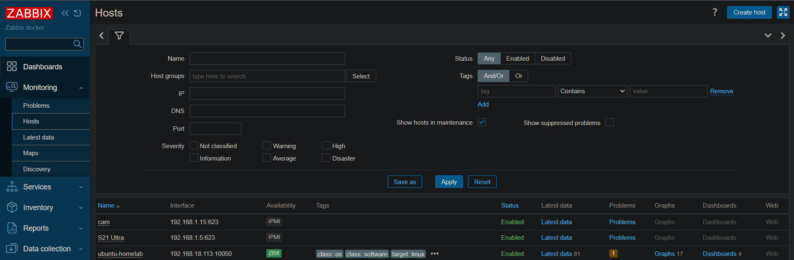
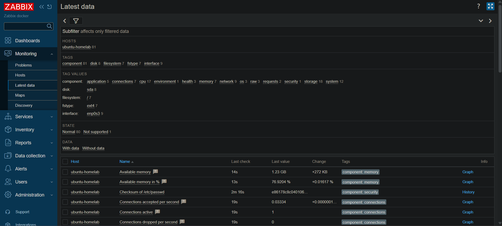
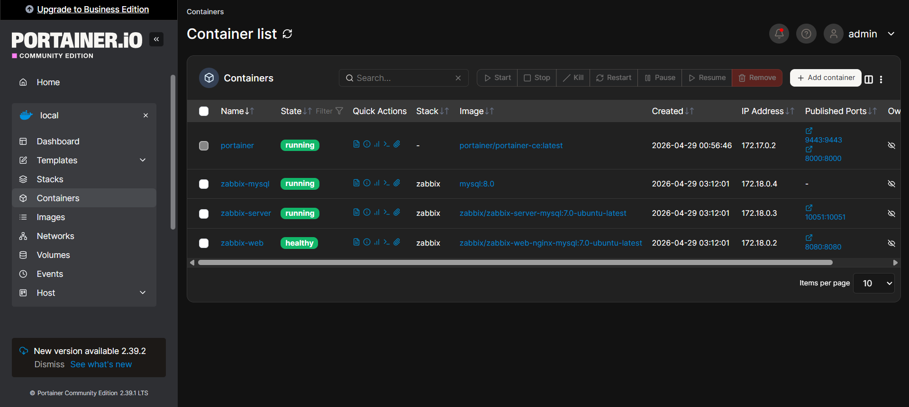
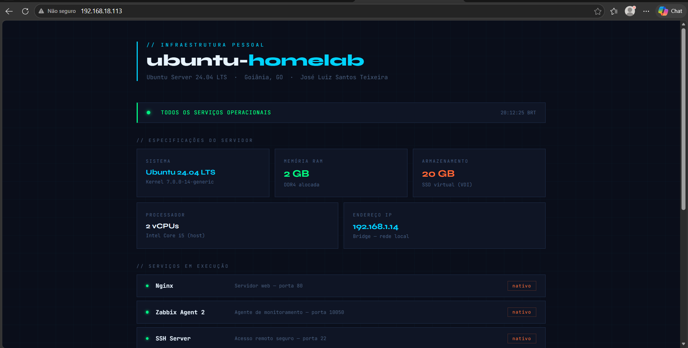

# 🖥️ Homelab — Zabbix Monitoring Lab

> Personal infrastructure lab featuring full-stack monitoring with Zabbix, Docker, and Ubuntu Server virtualized on VirtualBox.

---

## 📋 Overview

This project simulates a real corporate infrastructure environment built entirely on a personal machine. A Linux server is provisioned, monitored end-to-end by Zabbix, and serves a live web page via Nginx — all running locally with zero cloud cost.

**Key goals:**
- Practice real-world infrastructure monitoring
- Work with Linux server administration via SSH
- Deploy and manage services using Docker and Docker Compose
- Build hands-on experience with tools used in production environments

---

## 🏗️ Architecture

```
Windows 11 (Physical Host) — 192.168.1.8
│
├── Docker Desktop (WSL2)
│   ├── zabbix-server      ← monitoring engine
│   ├── zabbix-web         ← web interface (port 8080)
│   ├── zabbix-mysql       ← database backend
│   └── portainer          ← container manager (port 9443)
│
└── VirtualBox
    └── Ubuntu Server 24.04 LTS — 192.168.1.14
        ├── Zabbix Agent 2     ← sends metrics to Zabbix Server
        ├── Nginx              ← web server (port 80)
        └── OpenSSH Server     ← remote access
```

---

## 🛠️ Tech Stack

| Tool | Role |
|------|------|
| **Zabbix 7.0** | Infrastructure monitoring |
| **Docker Desktop** | Container runtime (WSL2) |
| **Docker Compose** | Multi-container orchestration |
| **Portainer CE** | Visual container management |
| **Ubuntu Server 24.04 LTS** | Monitored Linux server |
| **Nginx 1.28** | Web server running on the VM |
| **VirtualBox** | Type-2 hypervisor |
| **SSH** | Remote server administration |

---

## 📊 What's Being Monitored

- **CPU utilization** — real-time and historical
- **Memory usage** — available and used RAM
- **Disk I/O** — read/write throughput
- **Network traffic** — inbound/outbound on enp0s3
- **System uptime** — server availability
- **Running processes** — process count and status
- **Security** — critical file checksum monitoring
- **Nginx** — web server availability and connection metrics

---

## 🚀 How to Run

### Prerequisites
- Windows 10/11 with WSL2 enabled
- Docker Desktop installed
- VirtualBox installed
- Ubuntu Server 24.04 ISO

### 1. Clone the repository
```bash
git clone https://github.com/joseLuizz/homelab-zabbix.git
cd homelab-zabbix
```

### 2. Start Zabbix stack
```bash
docker compose up -d
```

Access Zabbix at `http://localhost:8080`
Default credentials: `Admin` / `zabbix`

### 3. Provision the VM
- Create a VirtualBox VM (2GB RAM, 2 CPUs, 20GB disk)
- Set network adapter to **Bridged**
- Install Ubuntu Server 24.04 LTS with OpenSSH enabled

### 4. Install Zabbix Agent on the VM
```bash
wget https://repo.zabbix.com/zabbix/7.0/ubuntu/pool/main/z/zabbix-release/zabbix-release_latest+ubuntu24.04_all.deb
sudo dpkg -i zabbix-release_latest+ubuntu24.04_all.deb
sudo apt update && sudo apt install zabbix-agent2 -y
```

Edit `/etc/zabbix/zabbix_agent2.conf`:
```
Server=<YOUR_WINDOWS_IP>
ServerActive=<YOUR_WINDOWS_IP>
```

```bash
sudo systemctl enable zabbix-agent2
sudo systemctl start zabbix-agent2
```

### 5. Add host in Zabbix
- Go to **Data collection → Hosts → Create host**
- Set IP to the VM's IP address
- Apply template: `Linux by Zabbix agent`

---

## 📁 Project Structure

```
homelab-zabbix/
├── docker-compose.yml     # Zabbix full stack definition
├── README.md              # This file
└── screenshots/           # Environment screenshots
    ├── dashboard.png
    ├── hosts.png
    ├── latest-data.png
    ├── portainer.png
    └── web-server.png
```

---

## 📸 Screenshots

### Zabbix Dashboard


### Host Monitoring


### Latest Data


### Portainer — Container Management


### Nginx Web Server


---

## 🔧 Useful Commands

**Start/stop the stack:**
```bash
docker compose up -d
docker compose down
```

**SSH into the VM:**
```bash
ssh user@<VM_IP>
```

**Check Zabbix agent status:**
```bash
sudo systemctl status zabbix-agent2
```

**View agent logs:**
```bash
sudo tail -f /var/log/zabbix/zabbix_agent2.log
```

---

## 👤 Author

**José Luiz Santos Teixeira**  
IT Analyst — Infrastructure & Technical Support  
Goiânia, GO — Brazil  
📧 pjjoseluiz@gmail.com  
🔗 [linkedin.com/in/jose-luiz-s](https://linkedin.com/in/jose-luiz-s)

---

*Built as a hands-on infrastructure lab to practice real-world monitoring, Linux administration, and container management.*
